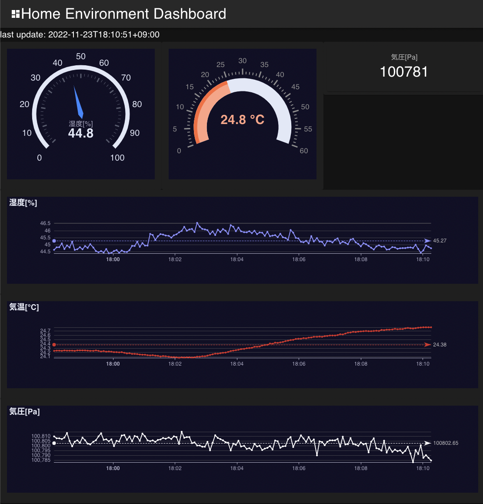

# BME280 sensing and dashboard



## Requirements

- [BME280](https://akizukidenshi.com/catalog/g/gK-09421/)
- raspberry pi zero wh

## Setup

### AWS

- Run following and note `certificateArn`
  ```
  aws iot create-keys-and-certificate \
      --certificate-pem-outfile "raspi01.cert.pem" \
      --public-key-outfile "raspi01.public.key" \
      --private-key-outfile "raspi01.private.key" \
      --set-as-active
  ```
- replace `context.certArn` of cdk.json by certificateArn
- `cdk deploy RaspberrypiSenseStack --require-approval never`

### Raspberry pi

- Enable I2C
  - `sudo raspi-config nonint do_i2c 0`
    - ignore following messages:
      > modprobe: ERROR: ../libkmod/libkmod.c:586 kmod_search_moddep() could not open moddep file '/lib/modules/5.4.79+/modules.dep.bin'  
      > modprobe: FATAL: Module i2c-dev not found in directory /lib/modules/5.4.79+
  - `sudo reboot`
  - `raspi-config nonint get_i2c`
    - if showing 0, that's ok
- Install i2c-tools

  - `sudo apt install i2c-tools -y`
  - `i2cdetect -y 1`
    - 76 will showing up

- Install IoT Greengrass
  - install aws cli
    - `sudo apt install python3-pip`
    - `pip3 install awscli --upgrade --user`
    - `echo "export PATH=/home/pi/.local/bin:$PATH" >> .bashrc`
    - `exec $SHELL -l`
    - `aws --version`
    - `export AWS_ACCESS_KEY_ID=XXXX`
    - `export AWS_SECRET_ACCESS_KEY=XXXX`
    - `aws s3 ls`
  - install nucleus
    - `sudo update-alternatives --config java`
    - `java -version`
    - `curl -s https://d2s8p88vqu9w66.cloudfront.net/releases/greengrass-nucleus-latest.zip > greengrass-nucleus-latest.zip`
    - `unzip greengrass-nucleus-latest.zip -d GreengrassInstaller && rm greengrass-nucleus-latest.zip`
  - run install command whose cfnOutput name is `RaspberrypiSenseStack.GreengrassInstallCommand` showing after `cdk deploy`
    - ex) `sudo -E java -Droot .....`
  - `sudo gpasswd -a ggc_user dialout`
  - `sudo gpasswd -a ggc_user gpio`

### Greengrass component

- greengrass development kit install ( for PC)
  - https://docs.aws.amazon.com/greengrass/v2/developerguide/install-greengrass-development-kit-cli.html
- `cd components/sensor`
- `gdk component build`
- `gdk component publish`
- attach s3 get policy to core device role

  - ```
    aws iot create-policy-version \
    --policy-name GreengrassTESCertificatePolicyGreengrassV2TokenExchangeRoleAlias \
    --policy-document file://policy.json \
    --set-as-default
    ```
  - policy.json:
    ```
        {
        "Version": "2012-10-17",
        "Statement": [{
            "Effect": "Allow",
            "Action": "iot:AssumeRoleWithCertificate",
            "Resource":
        "arn:aws:iot:{REGION}:{ACCOUNT}:rolealias/GreengrassV2TokenExchangeRoleAlias"
        },{
            "Effect": "Allow",
            "Action": "s3:*",
            "Resource": "*"
        }]
        }
    ```

- deploy component to raspberrypi by management console or cli
